# Security Misconfiguration Lab Report

## Environment
- **Account:** 871939031886
- **Region:** us-east-1
- **Date:** 2026-06-09

---

## Misconfigurations Identified

| # | Misconfiguration | Resource | Risk Level | STRIDE Category | Status |
|---|-----------------|----------|------------|-----------------|--------|
| 1 | Block Public Access disabled | `my-insecure-test-bucket-1780998804` | Critical | I — Information Disclosure | Fixed |
| 2 | SSH open to 0.0.0.0/0 | `sg-095eee4a02ee83c98` (insecure-ssh-sg) | Critical | S — Spoofing | Fixed |
| 3 | IAM role with AdministratorAccess | `InsecureAppRole` | Critical | E — Elevation of Privilege | Fixed |

---

## Misconfiguration 1: Public S3 Bucket

**Resource:** `my-insecure-test-bucket-1780998804`

Block Public Access was fully disabled (`BlockPublicAcls=false`, `IgnorePublicAcls=false`, `BlockPublicPolicy=false`, `RestrictPublicBuckets=false`), allowing anyone to attach a public bucket policy and expose objects to the internet.

> **Note:** An attempt to set `public-read` ACL on the test object failed with `AccessControlListNotSupported` — this account enforces `BucketOwnerEnforced` Object Ownership, which disables ACLs entirely. This is an additional protection layer not present on all accounts. The core misconfiguration (Block Public Access disabled) was still detectable by AWS Config.

**Detection:** AWS Config rule `s3-bucket-public-read-prohibited` → `NON_COMPLIANT`

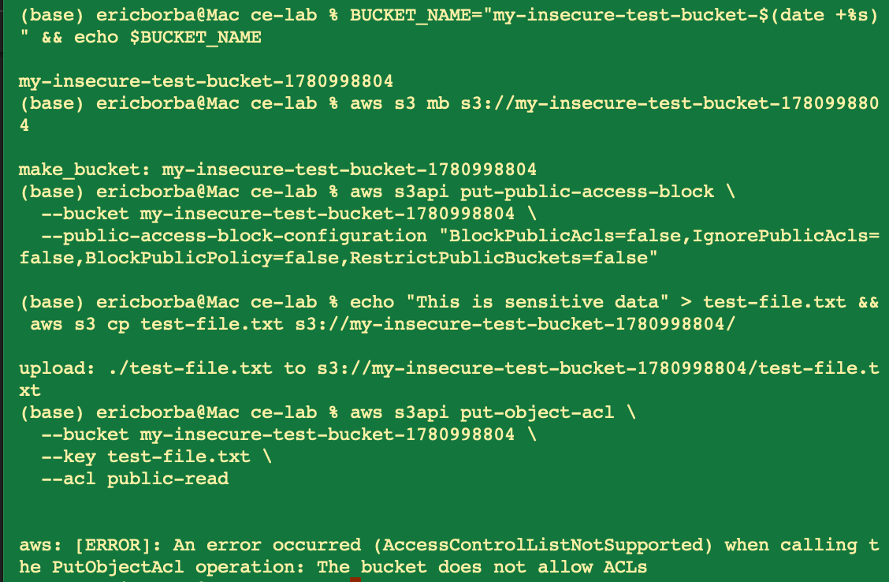

**Remediation:** Re-enabled all four Block Public Access flags + applied AES256 server-side encryption.

**Verified:** AWS Config rule `s3-bucket-public-read-prohibited` → `COMPLIANT`

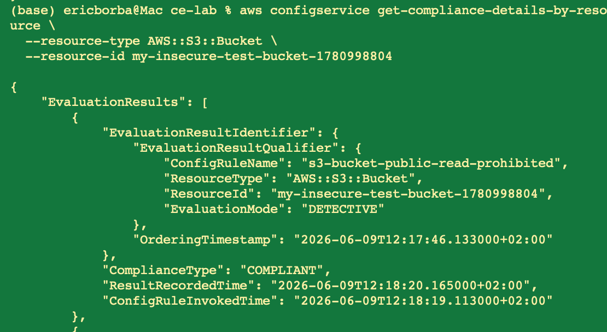

---

## Misconfiguration 2: Security Group SSH Open to Internet

**Resource:** `sg-095eee4a02ee83c98` (insecure-ssh-sg)

An inbound rule allowed TCP port 22 from `0.0.0.0/0`, exposing SSH to the entire internet. This enables brute-force attacks and potential instance compromise. During the lab, the `restricted-ssh` Config rule detected **6 non-compliant security groups** in the account — meaning this was not an isolated issue.

**Detection:** AWS Config rule `restricted-ssh` → `NON_COMPLIANT` (6 resources, including ours)

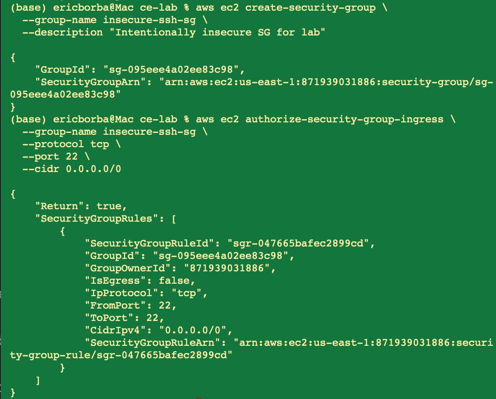
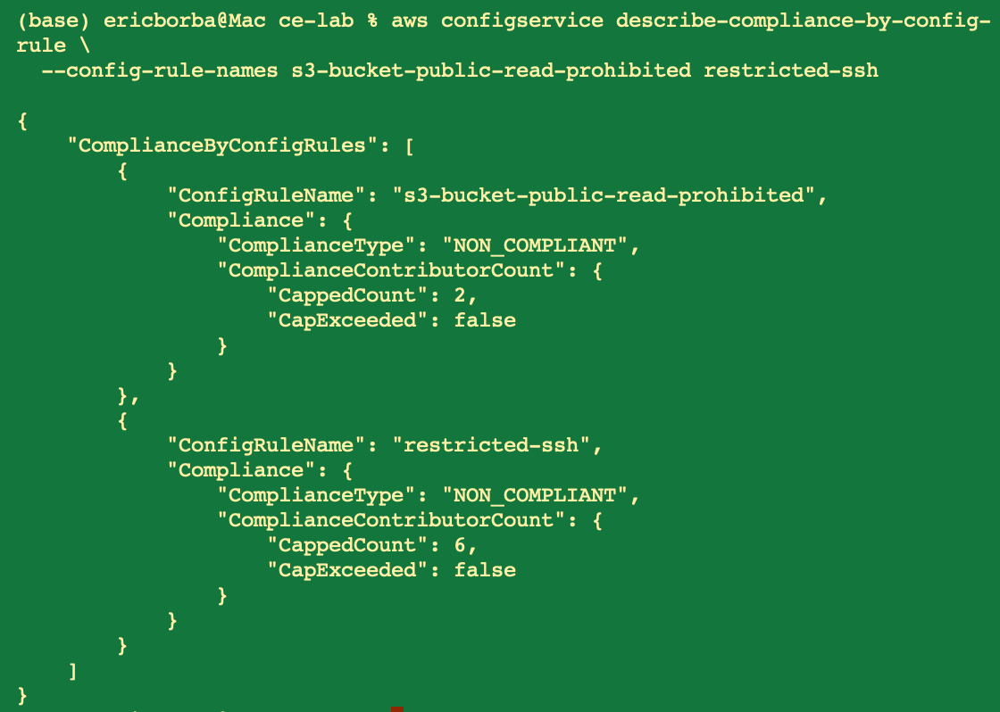

**Remediation:** Revoked the `0.0.0.0/0` rule and replaced it with a restricted CIDR `203.0.113.0/24` (representing a corporate VPN).

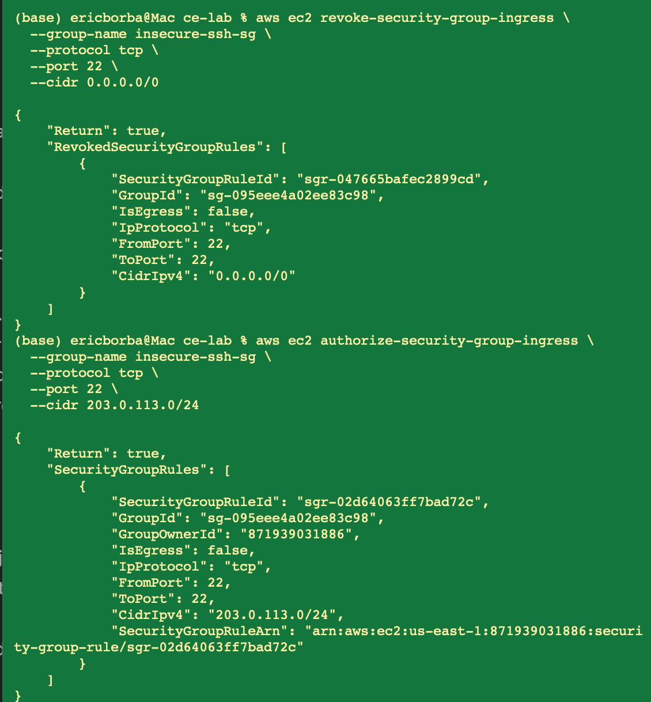

**Verified:** AWS Config rule `restricted-ssh` → `COMPLIANT` for `sg-095eee4a02ee83c98`. Rule count dropped from 6 → 5 non-compliant resources.

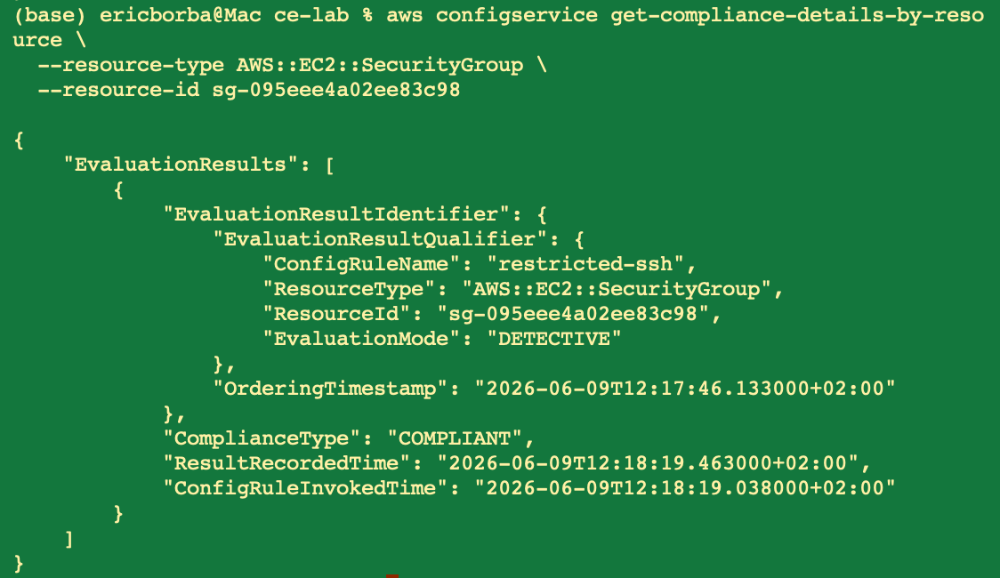

---

## Misconfiguration 3: IAM Role with AdministratorAccess

**Resource:** `InsecureAppRole` (`arn:aws:iam::871939031886:role/InsecureAppRole`)

An EC2 instance role was created with `AdministratorAccess` attached — full access to all AWS services and resources. A compromised application using this role could read/delete any data, create resources, exfiltrate secrets, or pivot to other accounts.

**Detection:** Manual review. No automated Config rule was configured for this in the lab. IAM Access Analyzer would catch this in a production environment.

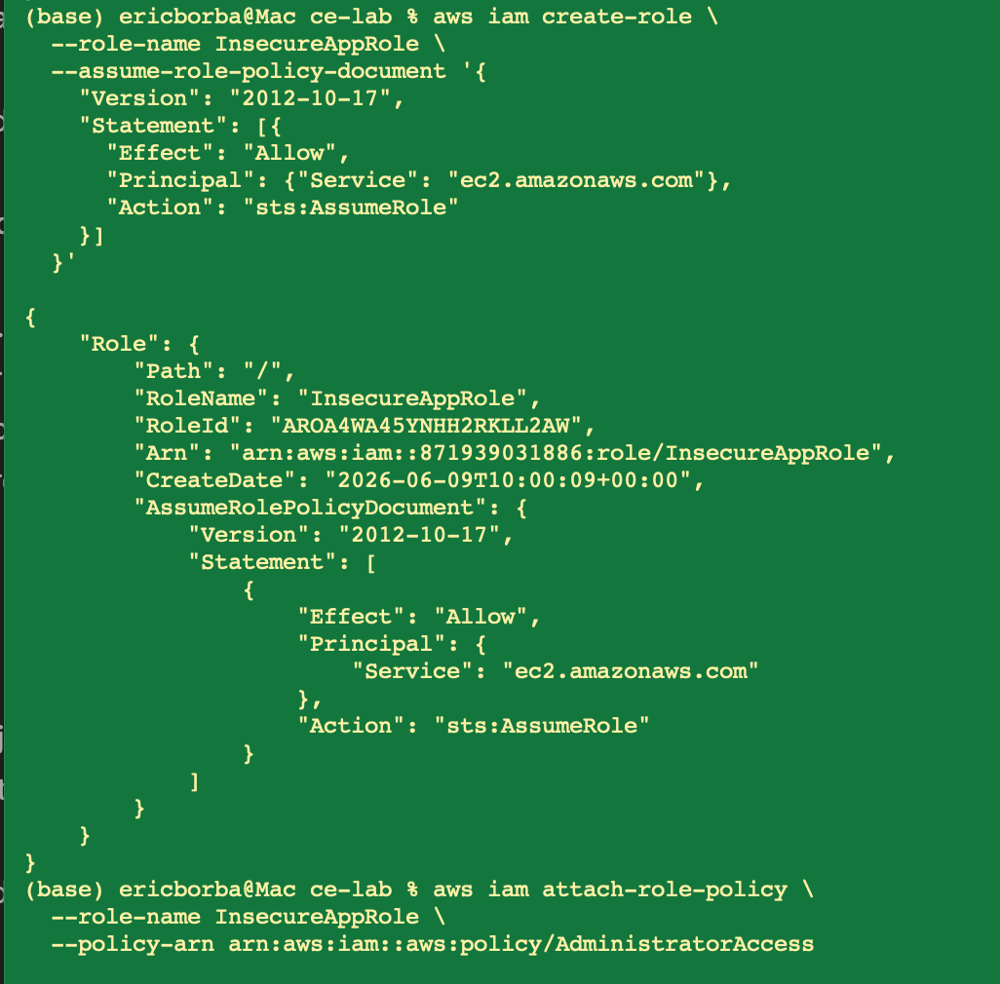

**Remediation:** Detached `AdministratorAccess` and replaced with a least-privilege inline policy (`AppLeastPrivilegePolicy`) granting only:
- `s3:GetObject` / `s3:PutObject` on `arn:aws:s3:::my-app-bucket/*`
- `secretsmanager:GetSecretValue` on `arn:aws:secretsmanager:*:*:secret:prod/db/*`

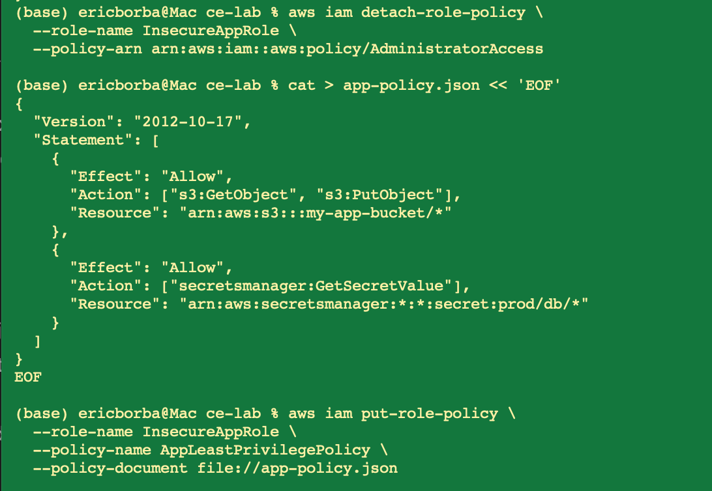

---

## AWS Config Setup

AWS Config was enabled from scratch for this lab. The lab's original instructions were missing the IAM role creation for Config and used incorrect recorder syntax — both were fixed during execution.

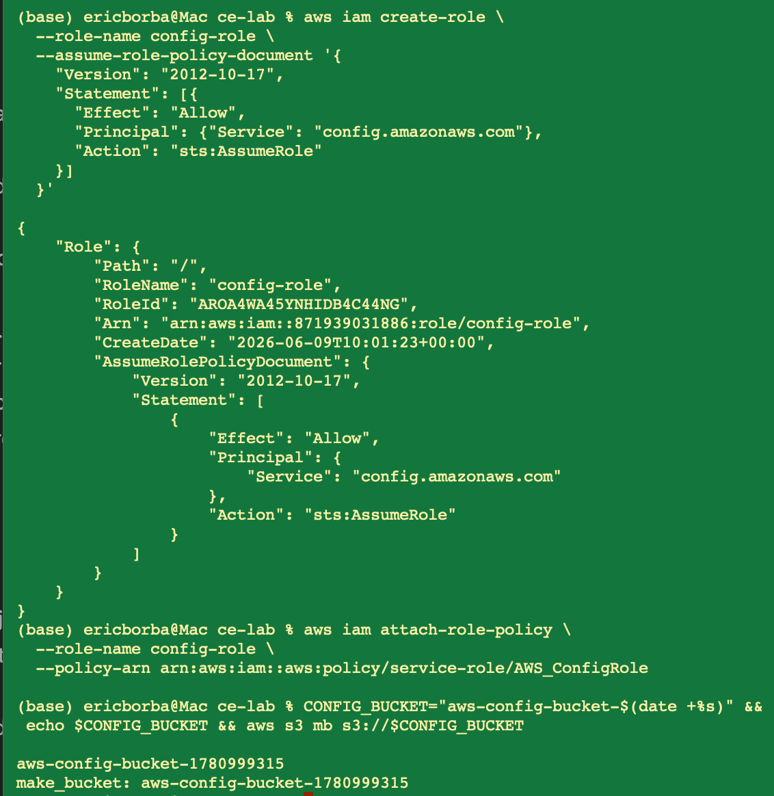
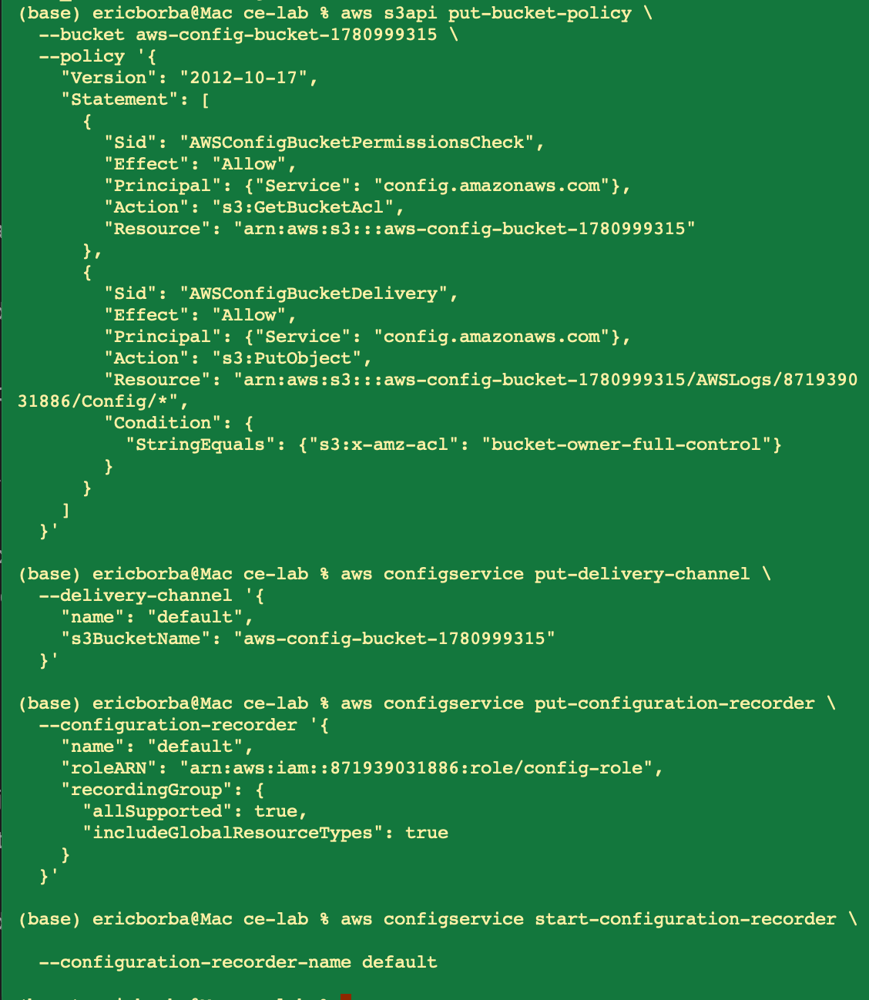
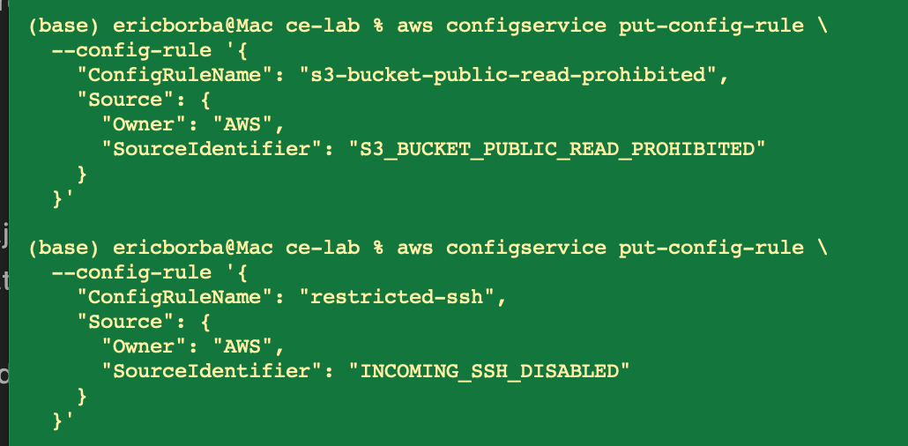

---

## Detection Methods

| Method | Misconfigurations Detected |
|--------|---------------------------|
| AWS Config rule `s3-bucket-public-read-prohibited` | Misconfiguration 1 |
| AWS Config rule `restricted-ssh` (`INCOMING_SSH_DISABLED`) | Misconfiguration 2 |
| Manual IAM policy review | Misconfiguration 3 |

---

## Lessons Learned

1. **Block Public Access is the primary S3 protection** — disabling it alone is enough to allow exposure via bucket policies, even without ACLs
2. **Object Ownership (BucketOwnerEnforced)** is now the AWS default and disables ACLs entirely — a newer layer of protection worth knowing about
3. **AWS Config rules evaluate asynchronously** — allow 2-5 minutes after resource changes for evaluation results to update
4. **Security groups accumulate open rules over time** — the `restricted-ssh` rule found 6 non-compliant groups in this account, not just the one created for this lab
5. **IAM Access Analyzer is essential** for ongoing detection of overly permissive roles — manual review alone does not scale

## Recommendations

1. Enable **Security Hub** for centralized findings across all Config rules, GuardDuty, and Inspector
2. Use **Infrastructure as Code** (Terraform/CDK) to enforce secure baselines at resource creation time
3. Enable **IAM Access Analyzer** at the organization level for continuous least-privilege monitoring
4. Conduct **quarterly security group reviews** — open SSH/RDP rules accumulate silently
